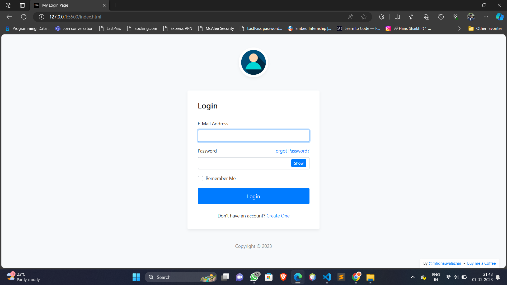
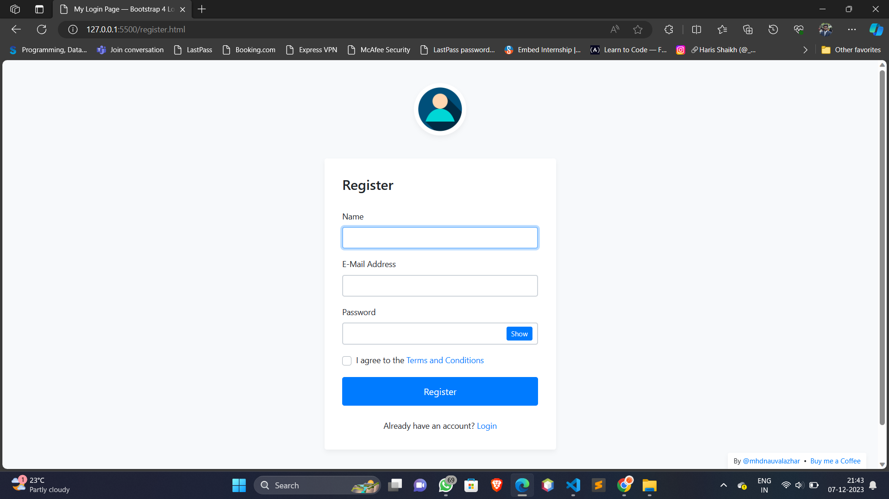
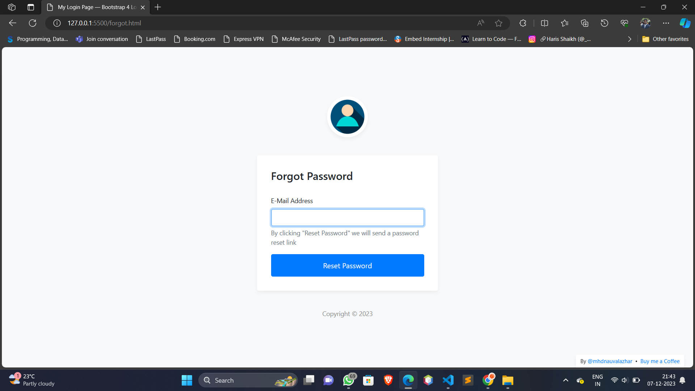
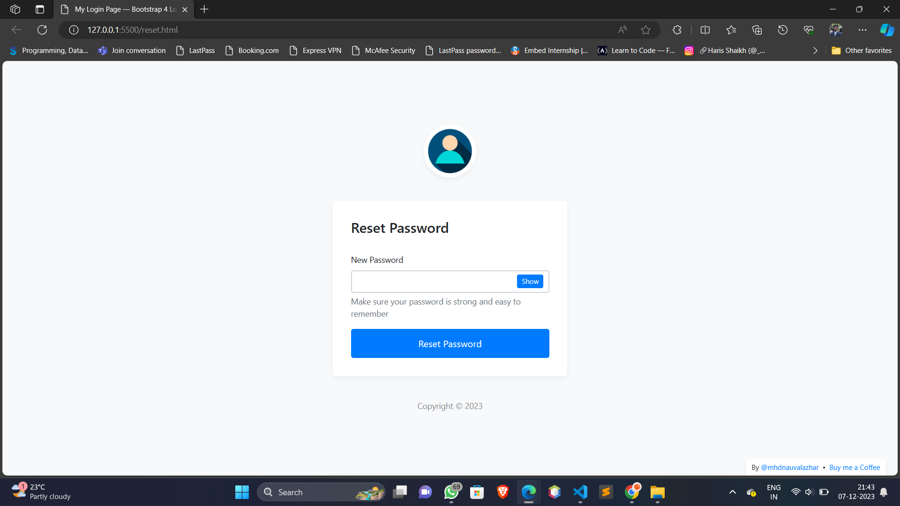

My Login is a Bootstrap 4 Login Page Snippet, you can use it as you wish and it's free for personal or commercial use.

![Preview]
<pre>
<!-- -->

</pre>

# Demo
- [Login]
<pre>
<!-- -->

</pre>

- [Register]
<pre>
<!-- -->

</pre>

- [Forgot Password]
<pre>
<!-- -->

</pre>

- [Reset Password]
<pre>
<!-- -->

</pre>

# Features
- Bootstrap 4.1.3
- Bootstrap 4 Validation
- Verified by W3C
- 4 Pages included (Login, Register, Forgot Password, Reset Password)
- Clean design
- Show/hide password
- Easy to use
- Cross-browser compatibility (Chrome, Firefox, Opera, IE11, Safari)
- Fully responsive
